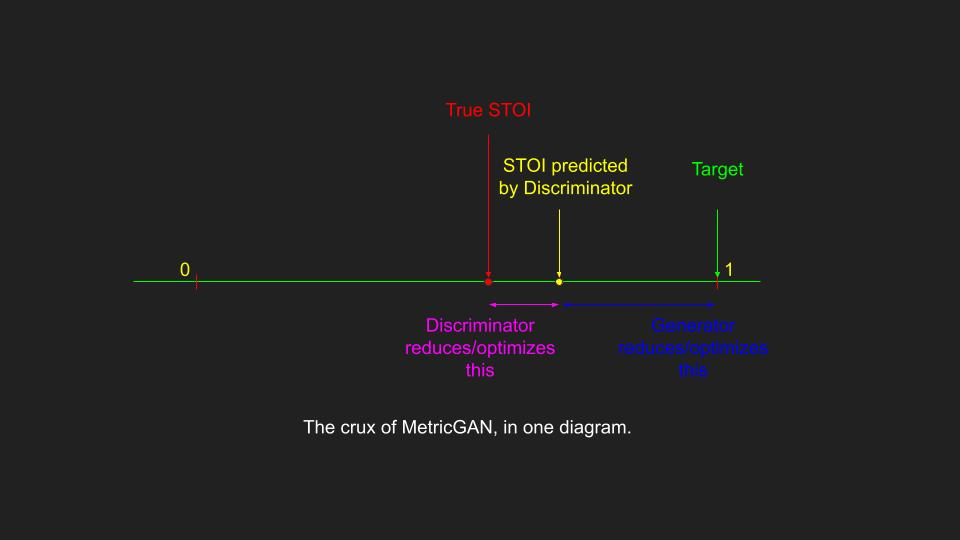

# MetricGAN-Reloaded
This is a pytorch implementation of MetricGAN [[1]](#1), made by my team for the CS 753 (ASR) mini-project under Prof. [Preethi Jyothi](https://www.cse.iitb.ac.in/~pjyothi/) at IIT Bombay. While the key ideas and basic model structure is taken from [[1]](#1)
- It takes only 300 utterances with 10 types of noise from the TIMIT [[2]](#2), which was not available to us. This would only constitute only around 9000 seconds or < 3 hours of data even assuming 3 seconds for each utterance. We trained our model on **30 hours** of training data and had **1 hour** of speech as testing data, created using a slightly modified version of the Microsoft Scalable Noisy Speech Dataset (MS-SNSD) [[3]](#3) and with **128 different types of noise**.
- We identified key failure modes of [[1]](#1) which led to unstable training and were specific to MetricGANs (v/s normal GANs) and present conclusions from and remedies to the same.
- We support denoising of both audio (.m4a and .wav) and video (.mp4) data.
We only use STOI [[4]](#4) using pystoi [[5]](#5), since the use of PESQ as in the paper required a license, access to which we did not have.

## Requirements
To install the python-requirements, run
```
pip install -r requirements.txt
```
We also use `ffmpeg` via `subprocess` calls, so install it with
```
sudo apt install ffmpeg
```
### Note
If your `pip` defaults to Python2, replace it with `pip3`.
## Usage
To train the model, first edit the configuration in `config.py` to your liking, then run
```
python main.py --train
```
To denoise an audio file (must be .wav or .m4a), run
```
python main.py --audio <filename> 
```
To denoise the audio in a video file (must be .mp4, output will also be in .mp4), run
```
python main.py --video <filename>
```
In both of the above cases, to have the output be named X, add `--out <X>` to the command.
To add noise to an audio file (must be .m4a or .wav) and then also produce the denoised version (for comparison or evaluation), run
```
python main.py --full-cycle --audio <audio-file> --noise <noise-file> [--snr <snr-level>]
```
The default SNR level used is 0.0.
### Note
If your `python` defaults to Python2, replace it with `python3`.
## Project Structure
The configuration of various parameters is done via `config.py`. For global parameters that are not configurable, we use `utils/globals.py`. The file `utils/data.py` contains helpers to load and process data/datasets before using for training the models/denoising audio/video. We place the models, dataloaders, optimizers and training code in `model/model.py`. The code to call the model to do the 'front-end' work of denoising audio/video clips, along with format conversion if necessary, is handled by functions in `model/utility.py`. The `main.py` is the main driver program that ties everything together. The directory `data/` contains our dataset, as well as noise and audio samples that can be used for demonstration purposes. Finally, the `checkpoints/` directory contains saved states and outputs of various model components from previous epochs. We include only the files from epoch 8 (the output directory is called `checkpoints/epoch7/` due to 0-indexing being used only for it) in the interest of space.
## Key Idea of MetricGAN
The key idea of MetricGAN [[1]](#1) is to use a Discriminator in a GAN not to decide fake/real, but rather to approximate a target metric such as STOI, scaled to the range [0,1]. The advantage of this approach is that by approximating a non-differentible target `T` by the discriminator `D`, we make the loss function of the generator `G` that depends on `D(G(x))` (`x` is the input), differentiable. Thus, training can proceed as normal for the generator even for a non-differentiable target metric such as STOI.
A picture is worth a thousand words, so here is one:
 

## Models
Our Generator consists of two BiLSTMs, followed a FC layer to 300 features, a Leaky ReLU layer with a Dropout of 0.05, followed by an FC layer to 257 features followed by a Sigmoid activation. The output of the Generator is used as a mask to be multiplied element-wise to the input audio's STFT to yield the STFT of the cleaned audio. All values less than 0.05 in the mask are set to 0.05 before doing so.

Our Discriminator differs somewhat from that in [[1]](#1). It consists of a BatchNorm layer followed by four (one more than [[1]](#1)) convolutional layers each with a leaky ReLU activation and spectral normalization [[6]](#6). These layers have 15, 35, 60 and 90 output channels respectively (more than in [[1]](#1)). Since we are dealing with series-data, we apply a global average pooling operation channel-wise at this point to change the shapes/sizes to a known value (90). This is followed by three FC layers with output sizes 50, 10 and 1 respectively. The layers use activations of Leaky ReLU x 2 and Sigmoid respectively, and all of them use spectral normalization. The sigmoid is also in contrast to the original MetricGAN paper.

## Training
We trained our model for 8 epochs, with the first 3 having 1 discriminator epoch + 2 generator epochs, and the rest have 2 epochs for the discriminator and generator each. The traning was done using a combination across time of P100 and T4 GPUs on Google Colab Pro. Each epoch of the 2+2 kind took roughly

45 x 2 + 54 x 2 + 30 

minutes for training the Discriminator, Generator and producing the Discriminator inputs for the next epoch, respectively, for around 3.75 hours per epoch. We used the MSE loss between predicted and actual STOI for the Discriminator. For the Generator, we chose

`Loss = MSE(2, discriminator output)`

since we found that this quickened the training. For both models the Adam optimizer was used with `betas = (0.9, 0.999)`. The learning rates used were `1e-4` and `2e-5` for the Generator and Discriminator, respectively.

## Failure Modes
We encountered a new kind of failure mode in the initial attempts which seems to be specific to MetricGANs. Specifically, since the initial STOIs would be in the range of 0.5 to 0.7 or 0.75, the Discriminator quickly learnt to predict roughly the middle value since the MSE loss would be rather small. This in itself would mean nothing more than slow training, but then, since this correlated pretty badly with actual STOI, the generator training would hurt actual STOI. Hence, the next epoch the Discriminator again predicted the "middle" values, which were now lower than the original ones. This cycle continued, degenerating the outputs into noise.

Specifically, the existence of a win-win scenario hurt Adverserial Training. We hypothesise that win-win situations are thus detrimental to *any* form of Adverserial Training. To overcome this, we
- increased the number of layers and hidden layer sizes of the Discriminator. However, this alone proved insufficient.
- added artificial examples to the Discriminator training data at every epoch to arrest the first step of the above feedback loop, ensuring that at least 20% of the samples passed to it had an STOI > 0.85. This helped a lot during the initial few epochs to stop any mode collapse.

Thus, we conclude that Data Augmentation is an effective means to remedy such scenarios.

## References
<a id="1">[1]</a> "MetricGAN: Generative Adversarial Networks based Black-box Metric Scores Optimization for Speech Enhancement", Szu-Wei Fu, Chien-Feng Liao, Yu Tsao and Shou-De Lin, ICML 2019.

<a id="2">[2]</a> "TIMIT Acoustic-Phonetic Continuous Speech Corpus LDC93S1. Web Download. Philadelphia: Linguistic Data Consortium", Garofolo, John S., et al., 1993.

<a id="3">[3]</a> "A Scalable Noisy Speech Dataset and Online Subjective Test Framework", Reddy et. al., Proc. Interspeech 2019

<a id="4">[4]</a> "A Short-Time Objective Intelligibility Measure for Time-Frequency Weighted Noisy Speech", ICASSP 2010, C.H.Taal, R.C.Hendriks, R.Heusdens, J.Jensen, Texas, Dallas.

<a id="5">[5]</a> https://github.com/mpariente/pystoi, accessed May 6, 2022.

<a id="6">[6]</a> 'Spectral Normalization for Generative Adversarial Networks", Miyato et. al., ICML 2018.